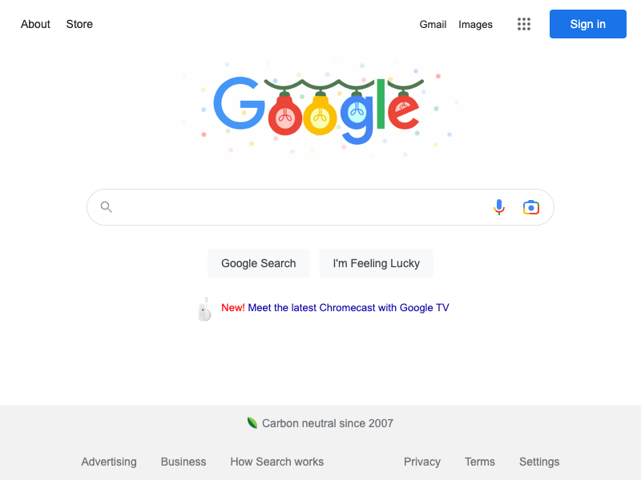

#  Dictionary

Full-featured dictionary extension

Logo inspo - https://www.veryicon.com/icons/business/colorful-office-icons/book-52.html



## Downloads
<table cellspacing="0" cellpadding="0">
  <tr style="text-align: center">
    <td valign="center">
      <a align="center" href="https://chrome.google.com/webstore/">
        
        <p align="center">Chrome Web Store</p>
      </a>
    </td>
    <td valign="center">
      <a href="https://addons.mozilla.org/firefox/extensions/">
        
        <p align="center">Firefox Add-ons</p>
      </a>
    </td>
        <td valign="center">
      <a href="https://addons.opera.com/en/extensions/">
        
        <p align="center">Opera Add-ons</p>
      </a>
    </td>
        <td valign="center">
      <a href="https://microsoftedge.microsoft.com/addons">
        
        <p align="center">Ms Edge Add-ons</p>
      </a>
    </td>
        <td valign="center">
      <a href="https://apps.apple.com/app/apple-store/">
        
        <p align="center">Safari Extensions</p>
      </a>
    </td>
  </tr>
</table>

## Features

* Define words on any website, simply by highlighting them and clicking on the extension's icon.
* Save and share definitions with others.
* Create custom dictionaries, with words and definitions that are important to you.
* Look up words in multiple dictionaries at once, to get a more complete picture of what a word means.
* Hear words pronounced, so you can learn how to say them correctly.
* See examples of how words are used in context, so you can learn how to use them correctly.
* Translate words into other languages, so you can learn how to say them in other languages.
* Find synonyms and antonyms of words, so you can find words that mean the same thing or the opposite thing.
* Find related words, so you can find words that are related to the word you are looking up.
* Find words that are commonly misspelled, so you can avoid making mistakes when you write.
* Find words that are commonly misused, so you can use them correctly.

## Project setup

```bash
# Install dependencies
npm install

# Build extension for development, watch for file changes and rebuild.
node tools/esbuild watch

# Generate compliant images assets for logo (default logo location src/assets/logo.png)
node tools/esbuild generateIcons

# Translate app strings to all supported chrome locales
node tools/esbuild translate

# Start an instance of Chromium with extension installed (using puppeteer)
# For Firefox, pass --browser=firefox as argument.
node tools/esbuild start 

# Build and package extension into a store-ready upload
node tools/esbuild --prod 

# Create extension package for Firefox/Opera/Edge by specifying --browser argument
node tools/esbuild --prod --browser=firefox

# Run tests
node tools/esbuild test
```

### Install Locally

#### Chrome
1. Open chrome and navigate to extensions page using this URL: chrome://extensions.
2. Enable the "Developer mode".
3. Click "Load unpacked extension" button, browse the `build/chrome-dev` directory and select it.

### Firefox
1. Open firefox and navigate to `about:debugging#/runtime/this-firefox`.
2. Click the "Load Temporary Add-on" button.
3. Browse the `build/firefox-dev` directory and select the `manifest.json` file.


### Data Source considerations

* Tried https://dictionaryapi.dev/, it's based on low-quality wikitionary data.
* Consider Oxford and Merriam Webster, rate limit issues.
* Consider scraping definitions off of Google, this would be prone to breakage everytime their CSS rules changes (which happens often). 

### Screenshot example queries
* Phrase - a stitch in time saves nine.
* Non english word. 
* A colloquial term.
* Plural form.
* A rare english word with nouns and verbs etc. 

### Todo
* Do not show for text selections in editors (docs, medium, office in edit mode)
* Add screenshot for right click, popup, i18n
* Add support for inline-feedback.